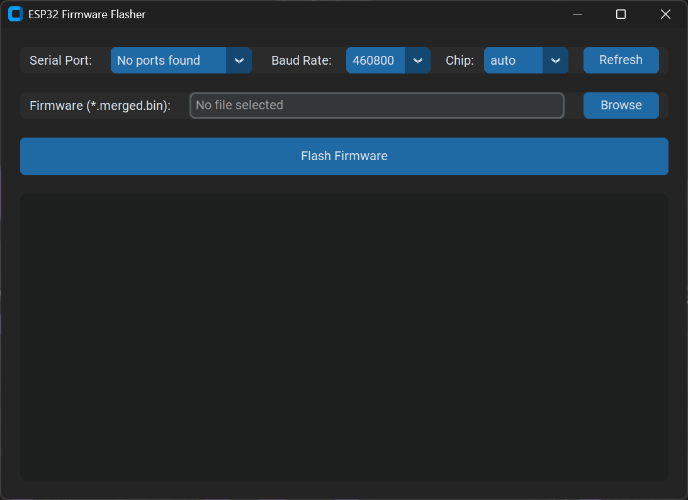

# ESP32 Firmware Flasher

A modern, standalone desktop GUI application for flashing firmware to ESP32 devices. Built with Python and CustomTkinter, it wraps the powerful `esptool` to provide a user-friendly experience similar to the deprecated `esphome-flasher` but with updated features and styling.

 *Add a screenshot here*

## Features

- **Modern Dark UI**: Clean and responsive interface using `customtkinter`.
- **Auto-Reset**: Automatically handles DTR/RTS signals to force the ESP32 into bootloader mode and reset it after flashing (mimics Arduino IDE behavior).
- **Formatted Logging**: Real-time console output with ANSI escape code stripping for clean, readable progress logs.
- **Merged Binary Support**: Optimized for `*.merged.bin` files (Bootloader + Partition Table + App), making flashing a single-step process.

## Requirements

- Python 3.8+
- Dependencies listed in `requirements.txt`

## Installation

1.  **Clone the repository**:
    ```bash
    git clone https://github.com/yourusername/esp32-flasher.git
    cd esp32-flasher
    ```

2.  **Install dependencies**:
    ```bash
    pip install -r requirements.txt
    ```

## Usage

### Running from Source

Run the application module:

```bash
python -m src.main
```

1.  **Select Port**: Choose your ESP32 device from the dropdown list.
2.  **Select Firmware**: Browse for your firmware file. It is recommended to use the generated `merged.bin` file which includes everything needed at offset `0x0`.
3.  **Flash**: Click the "Flash Firmware" button. The log will show progress and verify success.

### Building as Executable

To distribute this tool as a standalone `.exe` without requiring Python installed on the target machine, use PyInstaller:

```bash
pip install pyinstaller
pyinstaller --noconsole --onefile --name "ESP32Flasher" src/main.py
```

The executable will be generated in the `dist` folder.

## Contributing

Pull requests are welcome. For major changes, please open an issue first to discuss what you would like to change.

## License

[MIT](https://choosealicense.com/licenses/mit/)
